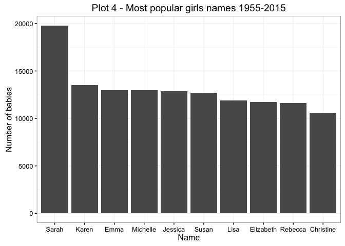
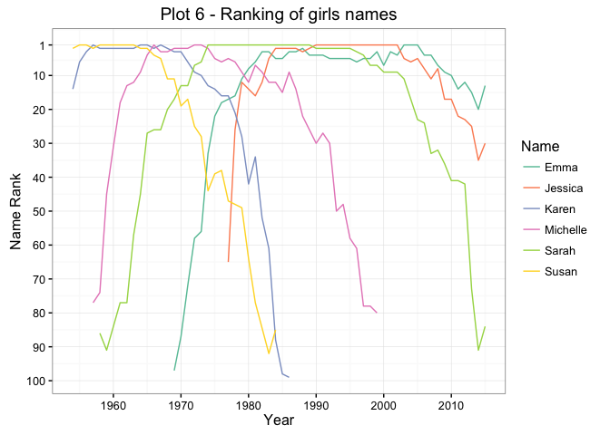

# NZ Baby Names
Tim Hill  
1 July 2016  


For the first couple of plots we'll look at three generations of my family - my parents, my sister and myself, and my two children.


Plot 1 shows the number of babies with the given names for the period 1954 - 2015

 

Plot 2 shows the ranking of the selected names (rank 1 = most popular name)

 

From the two plots above, you can probably guess what generation each of the names come from.


Now we'll dig into the data a bit deeper.  What are the most popular names in the period 1955 - 2015?

  


So what is the popularity of those names on a year by year basis?
For a cleaner plot, we'll only look at the top 6 for each sex.

  

Generally speaking, the most popular names have shown a decline in recent years.

What about sudden changes in popularity?
To look at this, two new variables will be created.

- **difference** - this is the difference in the number of babies with that name from one year to the next.
- **diffrank** - the difference in ranking for that name from one year to the next


```
##   Year   Name No.  Sex Rank difference diffrank
## 1 1990  Kylie  54 Girl   92       -168      -78
## 2 1971  Kelly 319 Girl   14        243       76
## 3 1991  Kayla 174 Girl   20        118       68
## 4 2012 Harper  94 Girl   33         94       68
## 5 2003  Jorja  96 Girl   34         96       67
## 6 1999  Paris 106 Girl   36        106       65
```

 


```
##   Year    Name No. Sex Rank difference diffrank
## 1 2012 Braxton 161 Boy   28        161       73
## 2 1965  Darren 390 Boy   13        316       71
## 3 1992 Brandon 174 Boy   34        174       67
## 4 2004  Ashton 117 Boy   41        117       60
## 5 2001   Lucas 102 Boy   43        102       58
## 6 1999 Lachlan 101 Boy   46        101       55
```

 

Some definite cultural events there - the name Brandon appearing from nowhere in 1992 due to 90210, and Jorja in 2003 - presumably thanks to Jorja Fox in CSI. 

The baby name data only contains details on the top 100 names for each year - what proportion of babies are included in this?  Are there many babies with names that don't make the top 100?

First, lets look at how many babies are included in the given data:

 

Unless the birth rate is dropping drastically, it appears that the top 100 names are accounting for a smaller and smaller proportion of new babies.


