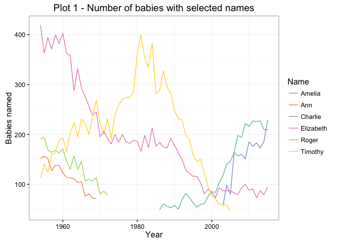

# NZ Baby Names


## The data

### Summary

The data for this analysis came from the New Zealand Department of Internal Affairs at https://www.dia.govt.nz/diawebsite.nsf/Files/Top-baby-names-1954-2015/$file/Top-baby-names-1954-2015.xlsx
The downloaded file is in an awkward xls format and was preprocessed into a more useable csv using another script.


```r
babynames <- read.csv("NZnamedata.csv", header=T)
summary(babynames)
```

```
##       Year             Name            No.           Sex      
##  Min.   :1954   David    :   62   Min.   :  39.0   Boy :6200  
##  1st Qu.:1969   Elizabeth:   62   1st Qu.:  72.0   Girl:6200  
##  Median :1984   George   :   62   Median : 110.0              
##  Mean   :1984   James    :   62   Mean   : 162.9              
##  3rd Qu.:2000   John     :   62   3rd Qu.: 195.0              
##  Max.   :2015   Joseph   :   62   Max.   :1514.0              
##                 (Other)  :12028                               
##       Rank       
##  Min.   :  1.00  
##  1st Qu.: 25.00  
##  Median : 50.00  
##  Mean   : 50.19  
##  3rd Qu.: 75.00  
##  Max.   :100.00  
## 
```
The summary shows what we would expect; the top 100 names given to babies, both boys and girls, born in the years 1954 - 2015. As well as the ranking for each year, the number of babies given the name is also shown.


### How many names?

Let's look at the number of unique names in the period.


```r
uniquenames <- babynames %>% group_by(Sex) %>% summarise("number" = n_distinct(Name)) %>% ungroup()

ggplot(uniquenames, aes(x=Sex, y=number, fill = Sex)) + 
  geom_bar(stat = "identity") + 
  scale_color_brewer(palette = "Set2") +
  theme(legend.position="none") +
  labs(title = "Plot 1 - Number of unique names")
```

<!-- -->

```r
uniquenames
```

```
## Source: local data frame [2 x 2]
## 
##      Sex number
##   (fctr)  (int)
## 1    Boy    316
## 2   Girl    390
```

Intereresting.  It looks like there are substantially less boys names than girls.

And now for a look at the number of babies given top 100 names - 


```r
yeartotals <- babynames %>% 
  group_by(Sex, Year) %>% 
  summarise(Total.in.top.100 = sum(No.))

ggplot(yeartotals, aes(x = Year, y = Total.in.top.100, group = Sex)) +
  geom_line(aes(colour = Sex)) +
  scale_color_brewer(palette = "Set2") +
  theme_bw() +
  theme(legend.key = element_blank()) +
  labs(title = "Plot 2 - Total Babies in the top 100 for each year")
```

<!-- -->

Assuming that the birth rate for boys and girls is 50/50, it's clear that parents are less adventurous when picking boys names - although that adventurousness has been steadily increasing since 1960.

To look at this a bit further, we'll incorporate some birth data to see what proportion of the total births are included in the top 100 names. (*Note - to do, statistics NZ website is down as at 17 Nov 2016*)

### Most popular names

Now we'll dig into the data a bit deeper.  What are the most popular names in the period 1955 - 2015?


```r
### Boys names
topboynames <- babynames %>% 
  filter(Sex == "Boy") %>% 
  group_by(Name) %>% 
  summarise(Number = sum(No.)) %>% 
  arrange(-Number) %>% 
  slice(1:10) %>% 
  mutate(Name = reorder(Name, -Number, sum)) 

ggplot(topboynames, aes(x = Name, y = Number)) + 
  geom_bar(stat="identity") +
  labs(title="Plot 3 - 10 Most popular boys names 1955-2015", y = "Number of babies") +
  theme_bw()
```

<!-- -->

```r
### Girls names
topgirlnames <- babynames %>% 
  filter(Sex == "Girl") %>% 
  group_by(Name) %>% 
  summarise(Number = sum(No.)) %>% 
  arrange(-Number) %>% 
  slice(1:10) %>% 
  mutate(Name = reorder(Name, -Number, sum))

ggplot(topgirlnames, aes(x = Name, y = Number)) + 
  geom_bar(stat="identity") +
  labs(title="Plot 4 - 10 Most popular girls names 1955-2015", y = "Number of babies") +
  theme_bw()
```

<!-- -->

There's obviously a big difference between boys and girls names.  The top boys name, Michael, accounts for 40,000 babies, whereas the most popular girls name, Sarah, accounts for only 20,000. 


So what is the popularity of those names on a year by year basis?
For a cleaner plot, we'll only look at the top 6 for each sex.


```r
### Top boys names

# Create vector of names
top6boysvec <- topboynames %>% select(Name) %>% slice(1:6) %>% droplevels() %>% .$Name

# Create df
top6boysdata <- babynames %>% filter(Name %in% top6boysvec & Sex == "Boy") %>% droplevels()

# Create plot  
ggplot(data = top6boysdata, aes(x = Year, y = No., colour = Name)) +
  geom_line(aes(colour = Name)) + 
  scale_color_brewer(palette = "Set2") +
  theme_bw() + 
  #scale_y_reverse(breaks = c(1,10,20,30,40,50,60,70,80,90,100)) + 
  labs(title = "Plot 5 - Top 6 boys names", y = "No. of babies") + 
  scale_x_continuous(breaks = seq(0, 2015, 10)) + 
  theme(legend.key = element_blank())
```

<!-- -->

```r
### Top girls names

# Create vector of required names
top6girlsvec <- topgirlnames %>% select(Name) %>% slice(1:6) %>% droplevels() %>% .$Name

# Create df 
top6girlsdata <- babynames %>% filter(Name %in% top6girlsvec & Sex == "Girl") %>% droplevels()

# Create plot  
ggplot(data = top6girlsdata, aes(x = Year, y = No., colour = Name)) +
  geom_line(aes(colour = Name)) + 
  scale_color_brewer(palette = "Set2") +
  theme_bw() + 
  #scale_y_reverse(breaks = c(1,10,20,30,40,50,60,70,80,90,100)) + 
  labs(title = "Plot 6 - Top 6 girls names", y = "No. of babies") + 
  scale_x_continuous(breaks = seq(0, 2015, 10)) + 
  theme(legend.key = element_blank())
```

<!-- -->

Generally speaking, the most popular names have shown a decline in recent years - although James is a perennial favourite.


### Changes in popularity

What about sudden changes in popularity?
To look at this, two new variables will be created.

- **difference** - this is the difference in the number of babies with that name from one year to the next.
- **diffrank** - the difference in ranking for that name from one year to the next


```r
### Need to add a variable with the annual difference - probably a cleaner way to do this
difference <- numeric(length = nrow(babynames))
diffrank <- numeric(length = nrow(babynames))

for(i in seq(1, nrow(babynames))) {
  currentyear <- babynames[i,1]
  currentname <- as.character(babynames[i,2])
  currentsex <- as.character(babynames[i,4])
  currentnum <- babynames[i,3]
  currentrank <- babynames[i,5]
  lastyear <- currentyear-1
  lastyear <- filter(babynames, Year == lastyear & Name == currentname & Sex == currentsex)
# the following two lines boldly assume that if the name did not appear in the previous years rankings, then there were no babies with that name, and that the ranking was 101
  lastnum <- ifelse(nrow(lastyear) == 0, 0, lastyear$No. )  
  lastrank <- ifelse(nrow(lastyear) == 0, 101, lastyear$Rank )
  difference[i] <- (currentnum - lastnum)
  diffrank[i] <- (lastrank - currentrank)
}

babynames <- cbind(babynames, difference, diffrank)

#########
```


```r
girlsdiffrank <- babynames %>% 
  filter(Year != "1954" & Sex == "Girl") %>% 
  arrange(-abs(diffrank)) %>% 
  distinct(Name) %>% 
  slice(1:6)

plotdatagirls <- filter(babynames, Name %in% girlsdiffrank$Name)

ggplot(plotdatagirls, aes(x = Year, y = Rank, group = Name, colour = Name)) + 
  geom_line(aes(colour = Name)) +
  scale_color_brewer(palette = "Set2") +
  theme_bw() + 
  labs(title = "Plot 7 - Top 6 movers in girls names") +
  scale_y_reverse(breaks = c(1,10,20,30,40,50,60,70,80,90,100)) +
  theme(legend.key = element_blank())
```

<!-- -->

```r
print(girlsdiffrank)
```

```
##   Year   Name No.  Sex Rank difference diffrank
## 1 1990  Kylie  54 Girl   92       -168      -78
## 2 1971  Kelly 319 Girl   14        243       76
## 3 1991  Kayla 174 Girl   20        118       68
## 4 2012 Harper  94 Girl   33         94       68
## 5 2003  Jorja  96 Girl   34         96       67
## 6 1999  Paris 106 Girl   36        106       65
```


```r
boysdiffrank <- babynames %>% 
  filter(Year != "1954" & Sex == "Boy") %>% 
  arrange(-abs(diffrank)) %>% 
  distinct(Name) %>% 
  slice(1:6)

plotdataboys <- filter(babynames, Name %in% boysdiffrank$Name)

ggplot(plotdataboys, aes(x = Year, y = Rank, group = Name, colour = Name)) + 
  geom_line(aes(colour = Name)) +
  scale_color_brewer(palette = "Set2") +
  theme_bw() + 
  labs(title = "Plot 8 - Top 6 movers in boys names") +
  scale_y_reverse(breaks = c(1,10,20,30,40,50,60,70,80,90,100)) +
  theme(legend.key = element_blank())
```

<!-- -->

```r
print(boysdiffrank)
```

```
##   Year    Name No. Sex Rank difference diffrank
## 1 2012 Braxton 161 Boy   28        161       73
## 2 1965  Darren 390 Boy   13        316       71
## 3 1992 Brandon 174 Boy   34        174       67
## 4 2004  Ashton 117 Boy   41        117       60
## 5 2001   Lucas 102 Boy   43        102       58
## 6 1999 Lachlan 101 Boy   46        101       55
```


## Some Specifics

### Three generations

For the first couple of plots we'll look at three generations of my family - my parents, my sister and myself, and my two children.


```r
girlsnames <- c("Elizabeth","Amelia","Ann")
boysnames <- c("Timothy", "Charlie","Roger")
selnames <- filter(babynames, (Name %in% girlsnames & Sex =="Girl") | 
                     (Name %in% boysnames & Sex =="Boy"))
```


```r
ggplot(data = selnames, aes(x = Year, y = No., colour = Name)) +
  geom_line(aes(colour = Name)) + 
  scale_color_brewer(palette = "Set2") +
  theme_bw() + 
  labs(title = "Plot 9 - Number of babies with selected names", y = "Babies named") +
  theme(legend.key = element_blank())
```

<!-- -->

Plot 9 shows the number of babies with the given names for the period 1954 - 2015


<!-- -->

Plot 10 shows the ranking of the selected names (rank 1 = most popular name)


